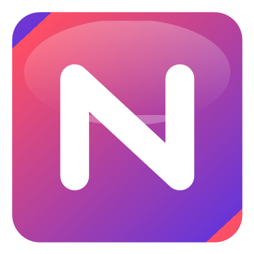

  

<h1 align="center">NowLayer</h1>

<strong>Your media. Your screen. Your rules.</strong>

  <a href="https://sayanpramanik2012.github.io/NowLayer/">Website</a>
  ·
  <a href="https://github.com/sayanpramanik2012/NowLayer/releases/latest">Download for Windows</a>
  ·
  <a href="https://github.com/sayanpramanik2012/NowLayer/issues">Report an issue</a>

NowLayer keeps music and video within view while you play. It places a compact, customizable media layer above borderless-windowed games and desktop apps—without requiring a browser extension, game integration, or another gaming platform running in the background.

## Stay in the moment

Checking a song title should not require an Alt+Tab. Neither should keeping a video nearby. NowLayer turns your active Windows media session or a selected video window into a clean overlay that stays exactly where you put it.

- **Live now-playing information** — See the track, artist, artwork, playback state, and a timeline that moves with your media.
- **Video PiP for the windows you already use** — Mirror YouTube, a browser window, or another compatible video player into a focused 16:9 view.
- **Game-safe click-through mode** — Lock NowLayer and mouse input passes directly to the game or app underneath it.
- **Control when you want it** — Unlock the overlay for playback controls, positioning, and customization, then lock it again in one keystroke.
- **Fits your setup** — Snap it to any edge or corner, drag it freely, switch to compact mode, and tune the opacity.
- **Time your way** — Run a clock-only widget, add a visible countdown, or set a daily alarm without leaving the game. Keep it inside the media layer or float it separately.
- **Alerts your way** — Silent timers shake the overlay; audible timers and alarms can use the built-in tone or your own audio file.
- **Ready when you are** — Optionally launch NowLayer with Windows so it is waiting in the system tray.
- **Private by design** — Media information, captured video, and preferences stay on your Windows PC.
- **Completely standalone** — No Overwolf client, account, browser extension, or game-specific plugin is required.

## Start playing

1. Download the newest **NowLayer Setup** file from [Releases](https://github.com/sayanpramanik2012/NowLayer/releases/latest).
2. Install and open NowLayer.
3. Start music in Spotify, YouTube Music, a browser, VLC, or another Windows media player.
4. Keep the overlay locked while playing, or open **Video PiP** to select a video window.

NowLayer remains available from the Windows system tray when its Control Center is closed.

## Shortcuts

| Action | Shortcut |
| --- | --- |
| Show or hide NowLayer | `Ctrl` + `Shift` + `M` |
| Lock or unlock interaction | `Ctrl` + `Shift` + `L` |
| Dismiss an active timer or alarm | `Ctrl` + `Shift` + `A` |

All three shortcuts are customizable from **Settings**. NowLayer checks that a chosen key combination is available before saving it.

## Compatibility

NowLayer is designed for Windows 10 and Windows 11. Borderless-windowed and windowed games provide the most reliable experience. True exclusive-fullscreen games can prevent ordinary desktop overlays from being displayed, and protected DRM video may intentionally appear black when captured.

Media information and controls depend on the source application publishing a Windows media session. The source video window must remain open and should not be minimized.

## Help shape NowLayer

Found a game, player, or display setup that needs attention? Open a [GitHub issue](https://github.com/sayanpramanik2012/NowLayer/issues) with the NowLayer diagnostic report and the steps that reproduce the problem.

For local testing and release procedures, see [TESTING.md](TESTING.md) and [docs/RELEASING.md](docs/RELEASING.md).

Copyright © Sayan Pramanik. All rights reserved.
